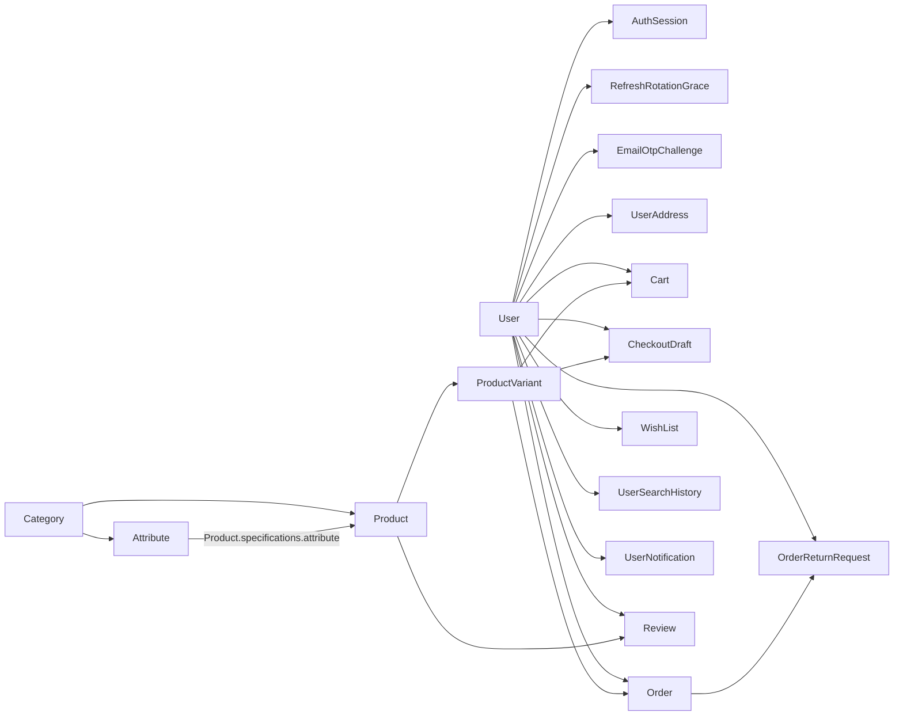

# Data model

## 1. High-level Relationships



Dữ liệu hỗ trợ hệ thống không nằm trong sơ đồ quan hệ chính:

```text
AuthRateLimit        ← persistent rate-limit counter
AdminResourceLock    ← lock record dùng để serialize category-tree transactions
AppLog               ← nơi lưu log ứng dụng trong MongoDB
```

## 2. User/auth aggregate

### `User`

Lưu danh tính và hồ sơ tài khoản, vai trò `USER` hoặc `ADMIN`, trạng thái xác minh, trạng thái hoạt động và thời điểm xóa đã lên lịch (`purgeAfter`). Hash mật khẩu chỉ được lấy khi luồng cần kiểm tra thông tin xác thực.

### `AuthSession`

Session được lưu trong database và định danh bằng `sessionId`. Bản ghi giữ hash refresh token, lựa chọn ghi nhớ đăng nhập, idle TTL, absolute TTL, lý do thu hồi và thông tin thiết bị. Session là authority của strict auth, đồng thời cung cấp dữ liệu cho danh sách phiên đăng nhập.

### `RefreshRotationGrace`

Bản ghi ngắn hạn xử lý các request làm mới token đồng thời. Nó giữ:

- `sessionId` + user;
- hash của refresh token cũ;
- cặp access token và refresh token mới đã mã hóa;
- thông tin ghi nhớ đăng nhập và cookie;
- `expiresAt` TTL.

Kịch bản: hai refresh request cùng dùng token cũ. Request đầu thực hiện token rotation; request sau dùng grace record còn hạn để nhận cùng cặp token thay vì bị coi là sử dụng lại token.

### `EmailOtpChallenge`

Challenge được phân theo mục đích:

- `VERIFY_EMAIL`;
- `RESET_PASSWORD`;
- `CHANGE_EMAIL`.

Database chỉ lưu OTP hash, không lưu plaintext OTP. Challenge giữ `expiresAt`, `verifiedAt`, `usedAt` và dữ liệu email tương ứng với từng mục đích.

Cách phát hành OTP và xử lý lỗi nằm trong [`../workflows/authentication-flows.md`](../workflows/authentication-flows.md).

## 3. Catalog aggregate

### `Category`

Category tree dùng trường `parent`. Một category chỉ khả dụng khi chính nó và toàn bộ parent chain đều active. Product hợp lệ trên storefront khi được gán vào một leaf category thỏa điều kiện này.

### `Attribute`

`Attribute` là model độc lập, không phải field definition được nhúng trong `Product`. Nó có:

- `name`;
- tham chiếu tới `category` sở hữu attribute;
- `unit` không bắt buộc.

Unique constraint hiện tại là `(category, name)`. Specification của product lưu tham chiếu tới `Attribute` cùng giá trị, qua đó giới hạn các attribute theo category cụ thể.

### `Product`

Dữ liệu chung của product gồm tên, slug, thương hiệu, mô tả, category, gallery, specifications, trạng thái đăng bán, `likes`, `sold` và rating aggregate `{sum,count,average}`.

### `ProductVariant`

Dữ liệu của một tùy chọn cụ thể của sản phẩm, gồm SKU, tùy chọn, giá bán, giá gốc, tồn kho, hình ảnh và trạng thái đăng bán.

Cart, checkout và order hoạt động theo product variant.

`Product.images` và `ProductVariant.image` có vòng đời hình ảnh Cloudinary độc lập.

## 4. Commerce aggregate

### `Cart`

Mỗi user có một cart. Cart lưu variant và số lượng; điều kiện hiển thị trên storefront được kiểm tra lại khi đọc hoặc thay đổi cart.

### `CheckoutDraft`

Bản ghi ngắn hạn của lựa chọn:

- source `cart` hoặc `buy-now`;
- variant + quantity;
- giá `unitPrice` tại thời điểm tạo;
- `expiresAt` TTL.

Draft không giữ trước tồn kho. Thời hạn và giới hạn số draft còn hiệu lực nằm trong [`../domains/cart-checkout-order.md`](../domains/cart-checkout-order.md).

### `Order`

Order lưu snapshot để lịch sử không phụ thuộc hoàn toàn vào dữ liệu catalog hiện tại:

- tham chiếu product và variant;
- tên và slug sản phẩm;
- image URL;
- options;
- unit price;
- quantity + returnedQuantity;
- shipping-address snapshot;
- note;
- total/status/completion/cancellation/inventory-restoration markers.

Trạng thái hiện chỉ có `SHIPPING`, `COMPLETED`, `CANCELLED`.

### `OrderReturnRequest`

Bản ghi trả hàng lưu đơn hàng, người dùng, dữ liệu mặt hàng và số tiền tại thời điểm trả.

Tác động tới tồn kho và thời hạn trả hàng nằm trong [`../domains/review-return.md`](../domains/review-return.md).

## 5. Engagement models

### `Review`

Review gắn với người dùng, order, product, variant, rating, nội dung, hình ảnh, trạng thái hiển thị và `likedBy`. Business rule ngăn review trùng cho cùng variant trong một order. Review đang hiển thị đóng góp vào rating aggregate của product.

Khi xóa dữ liệu tài khoản, hệ thống có thể đặt `Review.user=null` để giữ lịch sử đánh giá và ẩn danh tác giả. Chi tiết nằm trong [`../workflows/account-deletion-flow.md`](../workflows/account-deletion-flow.md).

### `WishList`

Lưu sản phẩm yêu thích của người dùng; thao tác thay đổi đồng bộ `Product.likes` trong transaction. Khi xóa dữ liệu tài khoản, hệ thống giảm lượt thích trước khi xóa danh sách yêu thích tương ứng.

### `UserSearchHistory`

Lịch sử phía server cho người dùng đã xác thực; giới hạn số mục nằm trong tài liệu nghiệp vụ người dùng.

### `UserNotification`

Lưu trạng thái thông báo của người dùng; hiện tại hỗ trợ thông báo đơn hoàn thành và thông báo yêu cầu xác minh email. Chi tiết nằm trong [`../domains/user-account.md`](../domains/user-account.md).

## 6. Supporting/system persistence

### `AuthRateLimit`

`AuthRateLimit` là fixed-window counter lưu trong MongoDB. `_id` là hash của scope và identifier; document giữ `scope`, `count`, `windowExpiresAt` và có TTL index theo thời điểm hết window.

Đây không phải quan hệ trực tiếp chỉ theo `User`: định danh có thể là IP, email, mã người dùng hoặc hash challenge tùy giới hạn. Chi tiết nằm trong [`../operations/auth-rate-limiting.md`](../operations/auth-rate-limiting.md).

### `AdminResourceLock`

Model nằm ở `models/catalog/catalog-lock.model.js`;

Row id hiện tại được dùng cho catalog serialization:

```text
_id = "category-tree"
```

Transaction thay đổi category và transaction cập nhật product quản trị cùng ghi vào lock record này để serialize các bước validation phụ thuộc category tree. Chi tiết nằm trong [`../workflows/admin-category-flow.md`](../workflows/admin-category-flow.md).

### `AppLog`

MongoDB log giữ `scope`, `severity`, `message`, `context` có cấu trúc, `stack` nếu có, `searchText` phục vụ tìm kiếm và `createdAt`.

Model có các index phục vụ truy vấn. Ngoài Vercel, file log được ghi song song và không được biểu diễn bằng model này. Xem chi tiết tại [`../operations/logging.md`](../operations/logging.md).


## 7. TTL data

Các model hiện có TTL index gồm:

| Model | TTL field |
| --- | --- |
| `AuthSession` | `absoluteExpiresAt` |
| `RefreshRotationGrace` | `expiresAt` |
| `EmailOtpChallenge` | `expiresAt` |
| `AuthRateLimit` | `windowExpiresAt` |
| `CheckoutDraft` | `expiresAt` |

Dùng để xóa các bản ghi không còn được sử dụng
