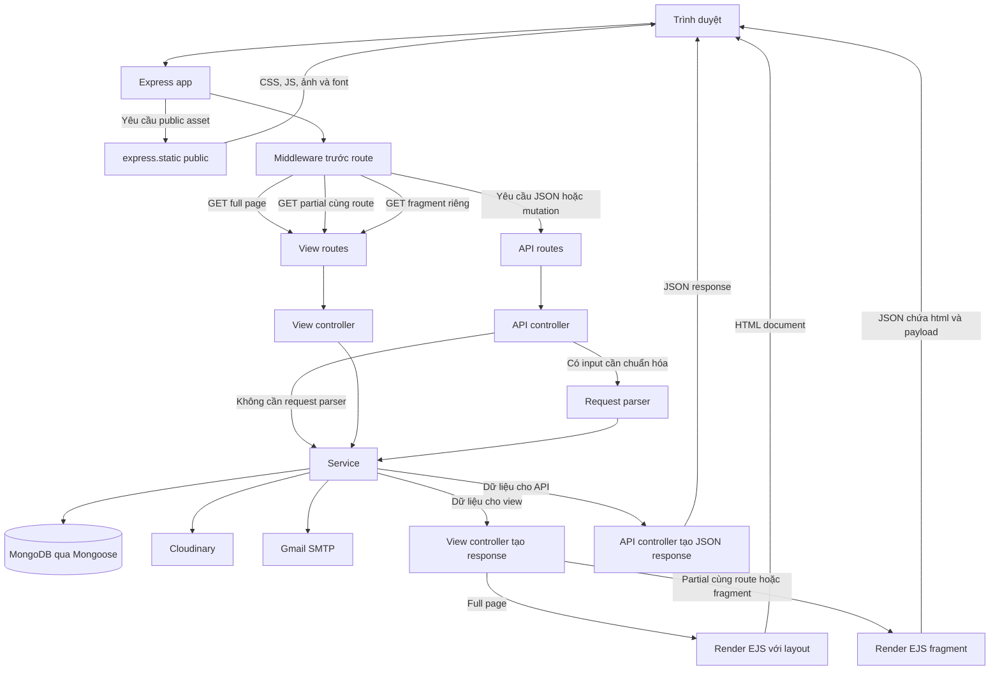

# System overview

> **Phạm vi:** runtime topology và các subsystem chính.  
> **Source of truth:** `server.js`, `app.js`, `routes/`, `config/`, `services/`.

## 1. Runtime topology



Error flow không được vẽ trong sơ đồ để tránh chồng chéo với các response path. Lỗi từ controller hoặc service đi tới `handleAppError`, sau đó trả HTML error page hoặc JSON error tùy loại request.

`server.js` kết nối MongoDB trước rồi mới `listen()`. `app.js` cấu hình middleware, view engine, routes và error pipeline.

## 2. Request flow

Hệ thống có bốn response pattern cần phân biệt:

1. **Full-page view request** — server render EJS + layout thành document HTML hoàn chỉnh.
2. **Same-route page partial request** — một số page route đọc `X-Partial-Target` và trả JSON chứa fragment HTML + metadata.
3. **Dedicated fragment request** — route riêng như product reviews/checkout addresses chạy query/view model riêng rồi trả JSON `{ html, ... }` qua `renderPartial(...)`.
4. **API request** — `/api/*`, controller parse input khi cần, gọi service rồi trả JSON.

JavaScript phía browser bổ sung partial navigation, fragment loading, modal workflow và mutation API trên nền server-rendered HTML.

## 3. Global middleware order

`app.js` áp dụng theo thứ tự logic:

```text
body parsers
→ cookie parser
→ security headers
→ static public/
→ attachLightAuth
→ same-origin protection
→ view routes (có refreshExpiredViewSession)
→ API routes
→ attachHeaderState cho full-page 404
→ not-found
→ error handler
```

Thứ tự middleware đảm bảo các route phía sau có đủ dữ liệu để xử lý và có thể trả lỗi sớm. Ví dụ, `attachLightAuth` chạy trước view và API routes để gắn access-token state vào request; strict auth chỉ được áp dụng tại route cần kiểm tra session trong database.


## 4. Subsystems

### Authentication

JWT access/refresh token trong HttpOnly cookie kết hợp `AuthSession` phía MongoDB. Có strict auth và light auth; refresh token rotation có grace window để xử lý concurrent refresh.

### Catalog

Category tree, Attribute, Product, ProductVariant, storefront eligibility, search/suggestion, rating aggregate.

### Commerce

Cart → `CheckoutDraft` → Order. Đặt hàng chạy trong MongoDB transaction, stock và `Product.sold` được điều chỉnh atomically cùng order/cart/draft.

### Post-purchase

Order completion, return và product review. Return cập nhật inventory và counter ngay trong transaction tạo return, không có approval workflow riêng.

### User/account

Profile, avatar, address, password/email, wishlist, search history, notifications và scheduled account deletion/purge.

### Admin

Dashboard, app logs, users, categories, products, orders và review moderation.

### Supporting/runtime persistence

Auth rate-limit counter, refresh-rotation grace, catalog resource lock và Mongo app-log records hỗ trợ concurrency, security và operations nhưng không thuộc các storefront aggregate chính. Xem [`data-model.md`](./data-model.md).

### External services

- **MongoDB**: lưu dữ liệu, chạy session transaction, quản lý TTL index và cung cấp Atlas Search khi khả dụng.
- **Cloudinary**: product/variant/avatar/review images.
- **Gmail SMTP**: transactional/OTP/security email qua Nodemailer.

## 5. Persistence assumptions

Các workflow cần cập nhật đồng bộ nhiều document, như tạo hoặc rotate auth session, tạo checkout draft, tạo/chuyển trạng thái/return order, cập nhật review rating và một số thao tác admin, đều dùng MongoDB transaction. Vì vậy runtime database phải hỗ trợ transaction, chẳng hạn MongoDB replica set hoặc Atlas.
