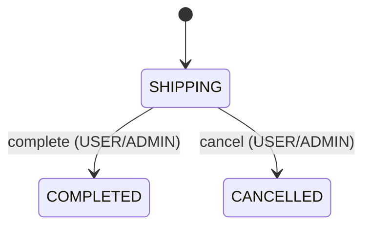

# Domain: Cart, Checkout, and Orders


## 1. Cart

Giỏ hàng thuộc người dùng đã xác thực. Các thao tác thay đổi giỏ hàng dùng light auth.

Các giới hạn và quy tắc hiện tại:

- tối đa **50 mặt hàng**;
- số lượng của mỗi item bị giới hạn theo commerce config hiện tại;
- khi thêm hoặc cập nhật phải kiểm tra variant, product, trạng thái của category tree và tồn kho;
- khi đọc giỏ hàng, hệ thống giữ lại mặt hàng không còn mua được để giao diện hiển thị lý do; người dùng vẫn có thể xóa mặt hàng đó.

Trạng thái không khả dụng phân biệt các nguyên nhân như variant, product hoặc category bị ẩn và tồn kho không đủ.

## 2. CheckoutDraft

Draft là dữ liệu trung gian giữa giỏ hàng hoặc mua ngay và đơn hàng.

```text
Cart hoặc Buy now selection
        ↓
CheckoutDraft
        ↓
Checkout page
        ↓
Order placement
```

Quy tắc hiện tại:

- source: `cart` hoặc `buy-now`;
- TTL **30 phút**;
- tối đa **10 draft còn hiệu lực cho mỗi người dùng**;
- khi đạt giới hạn, draft còn hiệu lực cũ nhất bị xóa trước khi tạo draft mới;
- các variant trùng nhau trong input được gộp số lượng;
- `unitPrice` được lưu tại thời điểm tạo draft;
- draft không giữ trước tồn kho.

## 3. Price snapshot semantics

Khi tạo order, hệ thống kiểm tra lại category, product và tồn kho nhưng **không cập nhật giá của draft hợp lệ theo giá variant mới**. `unitPrice` được lưu khi tạo draft và tiếp tục được dùng làm giá order trong thời gian draft còn hiệu lực.

Chi tiết xem tại [`../workflows/checkout-order-flow.md`](../workflows/checkout-order-flow.md).

## 4. Order placement invariants

Việc tạo đơn hàng được thực hiện trong cùng transaction với:

- order creation;
- stock decrement;
- `Product.sold` increment;
- cleanup cart nếu source là `cart`;
- xóa checkout draft.

MongoDB transaction là transaction boundary giữ các cập nhật này nhất quán.

Order dùng draft id làm `_id` để đảm bảo idempotency: một draft không thể tạo nhiều order khác nhau.

## 5. Order state machine



Không có `PENDING`, `PAID`, `PROCESSING` hay return status trong Order model, để giữ life cycle của order đơn giản và dễ quản lí.

### Complete

Đơn hàng ghi `completedAt`; notification được tạo best-effort sau transaction và không làm thất bại thao tác chính.

### Cancel

Đơn hàng ghi lý do hủy theo người thực hiện và tồn kho chỉ được khôi phục một lần. `inventoryRestoredAt` ngăn việc khôi phục tồn kho lặp lại.

## 6. Order snapshots

Địa chỉ giao hàng và dữ liệu hiển thị của mặt hàng được lưu vào đơn hàng. Những thay đổi sau đó đối với hồ sơ, địa chỉ hoặc danh mục sản phẩm không ghi lại lịch sử đơn hàng.

## 7. Return interaction

Return chỉ áp dụng cho order `COMPLETED`, item chưa được trả lại toàn bộ và vẫn còn trong thời hạn trả hàng.
